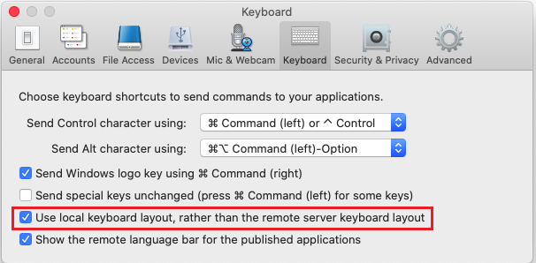
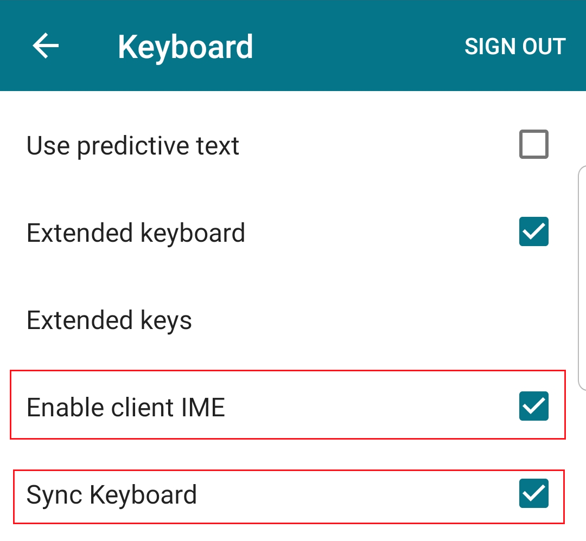

* [Citrix Virtual Apps and Desktops keyboard and IME configurations](#citrix-virtual-apps-and-desktops-keyboard-and-ime-configurations)
* [Keyboard Synchronization Mode](#keyboard-synchronization-mode)
  * [<span id="user\-content\-configmode1">Mode 1: Configure “Use VDA side default keyboard when logging in or reconnecting to the VDA” Mode</span>](#mode-1-configure-use-vda-side-default-keyboard-when-logging-in-or-reconnecting-to-the-vda-mode)
    * [Configure in configuration file](#configure-in-configuration-file)
    * [Configure in UI](#configure-in-ui)
      * [Citrix Workspace app for Windows](#citrix-workspace-app-for-windows)
    * [Configure in StoreFront](#configure-in-storefront)
    * [Configure in group policy](#configure-in-group-policy)
      * [Citrix Workspace app for Windows](#citrix-workspace-app-for-windows-1)
  * [<span id="user\-content\-configmode2">Mode 2: Configure “Use specific keyboard when logging in or reconnecting to the VDA” Mode</span>](#mode-2-configure-use-specific-keyboard-when-logging-in-or-reconnecting-to-the-vda-mode)
  * [<span id="user\-content\-configmode3">Mode 3: Configure “Only synchronize VDA side keyboard with client default keyboard when logging in or reconnecting to the VDA” Mode</span>](#mode-3-configure-only-synchronize-vda-side-keyboard-with-client-default-keyboard-when-logging-in-or-reconnecting-to-the-vda-mode)
    * [Configure in configuration file](#configure-in-configuration-file-1)
    * [Configure in UI](#configure-in-ui-1)
      * [Citrix Workspace app for Windows](#citrix-workspace-app-for-windows-2)
    * [Configure in StoreFront](#configure-in-storefront-1)
    * [Configure in group policy](#configure-in-group-policy-1)
      * [Citrix Workspace app for Windows](#citrix-workspace-app-for-windows-3)
  * [<span id="user\-content\-configmode4">Mode 4: Configure “Synchronize VDA side keyboard with client keyboard dynamically in the VDA session” Mode</span>](#mode-4-configure-synchronize-vda-side-keyboard-with-client-keyboard-dynamically-in-the-vda-session-mode)
    * [VDA configurations](#vda-configurations)
      * [Configure in registry](#configure-in-registry)
      * [Configure in Citrix group policy](#configure-in-citrix-group-policy)
    * [Citrix Workspace app configurations](#citrix-workspace-app-configurations)
      * [Configure in configuration file](#configure-in-configuration-file-2)
      * [Configure in UI](#configure-in-ui-2)
        * [Citrix Workspace app for Windows](#citrix-workspace-app-for-windows-4)
        * [Citrix Workspace app for MAC](#citrix-workspace-app-for-mac)
        * [Citrix Workspace app for Android](#citrix-workspace-app-for-android)
        * [Citrix Workspace app for iOS](#citrix-workspace-app-for-ios)
      * [Configure in StoreFront](#configure-in-storefront-2)
      * [Configure in group policy](#configure-in-group-policy-2)
        * [Citrix Workspace app for Windows](#citrix-workspace-app-for-windows-5)
* [Non\-Windows Citrix Workspace app support](#non-windows-citrix-workspace-app-support)
  * [<span id="user\-content\-configklmap">Enable Unicode Keyboard Layout Mapping for Windows VDA</span>](#enable-unicode-keyboard-layout-mapping-for-windows-vda)
    * [Configure in registry](#configure-in-registry-1)
    * [<span id="user\-content\-klmapgp">Configure in Citrix group policy</span>](#configure-in-citrix-group-policy-1)
  * [Recommend configuration](#recommend-configuration)
* [Generic Client IME for Chinese, Japanese, and Korean (CJK) Users](#generic-client-ime-for-chinese-japanese-and-korean-cjk-users)
* [Touch Keyboard in Windows 10](#touch-keyboard-in-windows-10)
* [Other Related Configurations](#other-related-configurations)
  * [Show/Hide Remote Language Bar](#showhide-remote-language-bar)
    * [Configure in UI](#configure-in-ui-3)
      * [Citrix Workspace app for Windows](#citrix-workspace-app-for-windows-6)
      * [Citrix Workspace app for MAC](#citrix-workspace-app-for-mac-1)
  * [Show/Hide Keyboard Layout Switch Pup\-up Message Box](#showhide-keyboard-layout-switch-pup-up-message-box)
    * [Configure in registry](#configure-in-registry-2)
    * [<span id="user\-content\-msgpopupgp">Configure in Citrix group policy</span>](#configure-in-citrix-group-policy-2)
* [101, 103 and 106 Keyboards](#101-103-and-106-keyboards)
* [Appendix A\. Supported Keyboard Name](#appendix-a-supported-keyboard-name)

# Citrix Virtual Apps and Desktops keyboard and IME configurations

[Citrix Virtual Apps and Desktops](https://www.citrix.com/products/citrix-virtual-apps-and-desktops/) offers rich configurations around keyboards and input method editors to support user and IT admin requirements, including languages and platforms. But configuring keyboards and IMEs correctly can be difficult because of factors like the variety of Citrix Workspace app clients, OS platforms, and more.

# Keyboard Synchronization Mode

Citrix Virtual Apps and Desktops supports both client keyboards and VDA-side keyboards. If client keyboard layout is different with VDA's, one common issue is which side of the keyboard layout is applied. The basic rules are:

1. <span id = "rule1">If the client is Citrix Workspace app for Windows, or set Citrix Workspace app for Linux in [mode 1](#mode1) the VDA-side keyboard will be applied, which means key input is determiend by VDA side keyboard layout.</span>
2. <span id = "rule2">If the client is a non-Windows Citrix Workspace app (Mac, Linux, iOS, or Android), the client keyboard will be applied, which means key input is determined by client side keyboard layout.</span>
3. <span id = "rule3">If rules [1](#rule1) and rule [2](#rule2) don’t work, there might be incorrect configurations or Citrix Virtual Apps and Desktops doesn’t support that type of scenario. If this is the case for you, contact [Citrix Customer Service](https://www.citrix.com/contact/customer-service.html).</span>

Another common issue is which keyboard layout is set on the VDA side when users log in or reconnect to a session. Does it sync the client keyboard layout to VDA-side ? If it doesn’t, which keyboard layout is used? It depends on the keyboard synchronization mode settings. Citrix Virtual Apps and Desktops supports four keyboard synchronization modes:

1. <span id = "mode1">**Use VDA side default keyboard when logging in or reconnecting to the VDA**</span>: This is the default setting when the client is Citrix Workspace app for Android and Citrix Workspace app for iOS. You can configure this setting through the client configure file or `default.ica` file in StoreFront. Any keyboard layout change in client side will not be synchronized to the VDA side in session.
2. <span id = "mode2">**Use a specific keyboard when logging in or reconnecting to the VDA**</span>: A specific keyboard layout can be configured through the client configuration file or `default.ica` file in StoreFront when logging in or reconnecting to the VDA. Any keyboard layout change on the client side will not be synchronized to the VDA side in session.
3. <span id = "mode3">**Only synchronize the VDA-side keyboard with client default keyboard when logging in or reconnecting to the VDA**</span>: This is the default setting when the client is Citrix Workspace app for Windows, Mac, or Linux. Any keyboard layout change on the client side will not be synchronized to the VDA side in session.
4. <span id = "mode4">**Synchronize the VDA-side keyboard with the client keyboard dynamically in the VDA session**</span>: When the user changes the client keyboard, the VDA keyboard will be synchronized automatically in session. Both the client and VDA have settings to enable this mode.

All four synchronization modes are exclusive, and individual clients can only work in one of the modes. If a user has more than one client, I don’t recommend setting different synchronization modes for every client, even if you can. That causes confusion about which keyboard will be applied in session when logging in and reconnecting through a different client.

Using mode [1](#mode1) and [2](#mode2) may cause inconsistency between the client keyboard and the VDA-side keyboard. For example, the client-side keyboard might display the German keyboard icon, but the VDA side might display the English keyboard icon. **Mode [1](#mode1) and [2](#mode2) normally are used in deployments that use only one kind of keyboard layout and where the client side does not need to change the keyboard layout**. For Windows OS, the VDA side default keyboard depends on the Windows OS language, the current user profile setting, and the Windows OS configurations. The keyboard layout in VDA is unknown in mode [1](#mode1), and using this mode is not recommended.

| <center>Citrix Workspace app</center> | <center>Default Synchronization Mode</center>                |
| :------------------------------------ | :----------------------------------------------------------- |
| Citrix Workspace app for Windows      | [**Mode 3**](#mode3): Only synchronize VDA side keyboard with client default keyboard when logging in or reconnecting to the VDA |
| Citrix Workspace app for Mac          | [**Mode 3**](#mode3): Only synchronize VDA side keyboard with  client default keyboard when logging in or reconnecting to the VDA |
| Citrix Workspace app for Linux        | [**Mode 3**](#mode3): Only synchronize VDA side keyboard with  client default keyboard when logging in or reconnecting to the VDA |
| Citrix Workspace app for Android      | [**Mode 1**](#mode1): Use VDA side default keyboard          |
| Citrix Workspace app for iOS          | [**Mode 3**](#mode3): Only synchronize VDA side keyboard with  client default keyboard when logging in or reconnecting to the VDA |
| Citrix Workspace app for HTML5        | [**Mode 3**](#mode3): Only synchronize VDA side keyboard with client default keyboard when logging in or reconnecting to the VDA |

<span id = "table11">Table 1.1 Default Synchronization Mode for Citrix Workspace app</span>

The sync mode supportability in different platform of Citrix Workspace app is below:

| <center>Citrix Workspace app</center> | Mode 1 | Mode 2 | Mode 3 | Mode 4 |
| :------------------------------------ | :----: | :----: | :----: | :----: |
| Citrix Workspace app for Windows      |  Yes   |  Yes   |  Yes   |  Yes   |
| Citrix Workspace app for Mac          |  Yes   |  Yes   |  Yes   |  Yes   |
| Citrix Workspace app for Linux        |  Yes   |  Yes   |  Yes   |  Yes   |
| Citrix Workspace app for Android      |  Yes   |   No   |   No   |  Yes   |
| Citrix Workspace app for iOS          |   No   |   No   |  Yes   |   No   |
| Citrix Workspace app for HTML5        |   No   |   No   |  Yes   |   No   |

<span id = "table12">Table 1.2 Sync Mode Supportability in Different Platform of Citrix Workspace app</span>

## <span id="configmode1">Mode 1: Configure “Use VDA side default keyboard when logging in or reconnecting to the VDA” Mode</span>

This mode will not synchronize client keyboard layout to VDA-side when logging in or reconnecting to the VDA. There are two levels for configuring this mode. One is through modifying the local configure file installed with the Citrix Workspace app for each user. The other is through modifying `default.ica` in the StoreFront server. The StoreFront configuration has higher priority than the client local file configuration.

### Configure in configuration file

| <center>Citrix Workspace app</center> | <center>Configuration</center>                               |
| ------------------------------------- | ------------------------------------------------------------ |
| Citrix Workspace app for Windows      | File path: `%appdata%\ICAClient\APPSRV.ini`  Change setting in `[WFClient]`: `KeyboardLayout=(Server  Default)` |
| Citrix Workspace app for MAC          | File path: `~/Library/Application Support/Citrix  Receiver/Config`  Change setting in `[WFClient]`: `KeyboardLayout=(Server  Default)` |
| Citrix Workspace app for Linux        | File path:  `~/.ICAClient/wfclient.ini`  Change setting in `[WFClient]`: `KeyboardLayout=(Server  Default)` |
| Citrix Workspace app for Android      | Does not support configuration file                          |
| Citrix Workspace app for iOS          | Does not support configuration file                          |
| Citrix Workspace app for HTML5        | Does not support configuration file                          |

<span id = "table1111">Table 1.1.1.1 `Use VDA side default keyboard` Mode in Local File Configuration</span>

### Configure in UI

#### Citrix Workspace app for Windows

 Open `Advanced Preferences` -> `Keyboard and Language bar` -> `Keyboard layout` page, `Don’t sync` option after **version 2103** to replace setting in configure file.


### Configure in StoreFront

Path: `C:\inetpub\wwwroot\Citrix\%StoreName%\App_Data\default.ica`

Change setting in `[WFClient]`: `KeyboardLayout=(Server Default)`

### Configure in group policy

**Only `Citrix Workspace app for Windows ` support group policy**. **The high priority is group policy > StoreFront configuration > UI configuration**

#### Citrix Workspace app for Windows

Refer to [Keyboard layout and language bar](https://docs.citrix.com/en-us/citrix-workspace-app-for-windows/configure.html#keyboard-layout-and-language-bar) in Citrix Workspace app for Windows product document. It is supported after **version 2103**. Change settings as below:


## <span id="configmode2">Mode 2: Configure “Use specific keyboard when logging in or reconnecting to the VDA” Mode</span>

This mode also supports the [file configuration](#Configure-in-configuration-file) and the [StoreFront configuration](#Configure-in-StoreFront). It uses the same configuration item in the [file configuration](#Configure-in-configuration-file). Users can set the specific keyboard layout listed in [Appendix A](#Appendix-A-Supported-Keyboard-Name). For example, set the specific keyboard to “French” in the configure file when logging in or reconnecting to the VDA and change the setting in `[WFClient]`: `KeyboardLayout=French`.


## <span id="configmode3">Mode 3: Configure “Only synchronize VDA side keyboard with client default keyboard when logging in or reconnecting to the VDA” Mode</span>

This mode will synchronize the client keyboard layout to the VDA side once when logging in or reconnecting to the VDA. This mode also support the [file configuration]((#Configure-in-configuration-file))  and  [StoreFront configuration](#Configure-in-StoreFront).

This mode isn’t supported by all Citrix Workspace app types, as shown in the following table:

| <center>Citrix Workspace app</center> | <center>Support</center>                                     |
| -------------------------------------- | ------------------------------------------------------------ |
| Citrix Workspace app for Windows       | Yes                                                          |
| Citrix Workspace app for MAC           | Yes                                                          |
| Citrix Workspace app for Linux         | Yes                                                          |
| Citrix Workspace app for Android       | No                                                           |
| Citrix Workspace app for iOS           | Yes                                                          |
| Citrix Workspace app for HTML5         | Yes, but judge the client keyboard layout according to the current display language of the browser. |

<span id = "table131">Table 1.3.1 Citrix Workspace app Capability for `Only synchronize VDA side keyboard with client default keyboard when logging in or reconnecting to the VDA` Mode</span>

### Configure in configuration file

It uses the same configuration item in the [file configuration](#Configure-in-configuration-file). You’ll change the setting in `[WFClient]`: `KeyboardLayout=(User Profile)`.

### Configure in UI

#### Citrix Workspace app for Windows

 Open `Advanced Preferences` -> `Keyboard and Language bar` -> `Keyboard layout` page, `Sync only once - when the session launches` option after **version 2103** to replace setting in [configure file](#Configure-in-configuration-file).


### Configure in StoreFront

It uses the same configuration item in the [StoreFront configuration](#Configure-in-StoreFront). You’ll change the setting in `[WFClient]`: `KeyboardLayout=(User Profile)`.


### Configure in group policy

**Only `Citrix Workspace app for Windows ` support group policy**. **The high priority is group policy > StoreFront configuration > UI configuration**


#### Citrix Workspace app for Windows

Refer to [Keyboard layout and language bar](https://docs.citrix.com/en-us/citrix-workspace-app-for-windows/configure.html#keyboard-layout-and-language-bar) in Citrix Workspace app for Windows product document. It is supported after **version 2103**. Change settings as below:


## <span id="configmode4">Mode 4: Configure “Synchronize VDA side keyboard with client keyboard dynamically in the VDA session” Mode</span>

This mode will synchronize the client keyboard to the VDA side in the session every time the client keyboard is changed. It will always maintain keyboard consistency between the client and the VDA side. This mode does not support synchronizing of the VDA side keyboard to the client side if users change the keyboard in the VDA side. For CJK (Chinese, Japanese, Korean) users, this mode will enable them to use the client IME instead of the VDA-side IME. This mode is also called the **Client Keyboard Synchronization and Generic Client IME** feature, and you **must configure both the client and VDA sides** to enable this feature.


### VDA configurations

#### Configure in registry

**It is obsolete. Use group policy instead of registry configuration.**

| <center>VDA</center> | <center>Configuration</center>                               |
| -------------------- | ------------------------------------------------------------ |
| Windows VDA          | Default On for Windows Server 2012, Windows 10.  Default Off for Windows Server 2016 and Windows Server  2019. Need to add registry:  `HKLM\Software\Citrix\ICA\IcaIme\DisableKeyboardSync` value = DWORD 0     This setting enables client keyboard synchronization  dynamically and generic client IME. |
| Linux VDA            | Default Off.  Enable client keyboard synchronization dynamically, run  the command:     `/opt/Citrix/VDA/bin/ctxreg update -k “HKEY_LOCAL_MACHINE\System\CurrentControlSet\Control\Citrix\LanguageBar”  -v “SyncKeyboardLayout” -d “0x00000001”`     Enable generic client IME, run the command:     `/opt/Citrix/VDA/bin/ctxreg update -k  “HKEY_LOCAL_MACHINE\System\CurrentControlSet\Control\Citrix\LanguageBar” -v  “SyncClientIME” -d “0x00000001”` |

<span id="table14111">Table 1.4.1.1.1 VDA Configuration for `Synchronize VDA side keyboard with client keyboard dynamically in VDA session` Mode</span>


#### Configure in Citrix group policy

After Windows VDA version **1912 CU2** and **2006**, Linux VDA **2012**, VDA configuration support Citrix Group Policy. Refer to [this blog](https://www.citrix.com/blogs/2020/07/30/citrix-virtual-apps-and-desktops-keyboard-and-ime-group-policies/) for detail. Enable VDA dynamic client keyboard layout sync and IME improvement is below:


### Citrix Workspace app configurations

#### Configure in configuration file

| <center>Citrix Workspace app</center> | <center>Configuration</center>                               |
| -------------------------------------- | ------------------------------------------------------------ |
| Citrix Workspace app for Windows       | File path: `%appdata%\ICAClient\APPSRV.ini`  Change setting in `[WFClient]`: `LocalIME=1` or run command `wfica32.exe /localime:off` command from the Citrix Workspace app installation folder `C:\Program Files (x86)\Citrix\ICA Client`. Refer to [Generic client Input Method Editors (IME)](https://docs.citrix.com/en-us/citrix-workspace-app-for-windows/configure.html#generic-client-input-method-editors-ime). |
| Citrix Workspace app for MAC           | Does not support configuration file.                         |
| Citrix Workspace app for Linux         | Configure file  path: `/opt/Citrix/ICAClient/config/module.ini`  Section `[ICA 3.0]`: `KeyboardSync=On`  Find more details on [Keyboard layout synchronization](https://docs.citrix.com/en-us/citrix-workspace-app-for-linux/configure-xenapp.html#keyboard-layout-synchronization). |
| Citrix Workspace app for Android       | Does not support configuration file.                         |
| Citrix Workspace app for iOS           | Does not support configuration file.                         |
| Citrix Workspace app for HTML5         | This mode is not supported.                                  |

<span id="table14211">Table 1.4.2.1.1 CWA Configure for `Synchronize VDA side keyboard with client keyboard dynamically in VDA session` Mode</span>


#### Configure in UI

##### Citrix Workspace app for Windows

Open `Advanced Preferences` -> `Keyboard and Language bar` -> `Keyboard layout` page, `Allow dynamic sync` option after **version 2103** to replace setting in [configuration file](#table14211).


##### Citrix Workspace app for MAC

Open Citrix Workspace app `Preferences` -> `Keyboard` and select `Use local keyboard layout, rather than the remote server keyboard layout.`. Refer to [Keyboard layout synchronization](https://docs.citrix.com/en-us/citrix-workspace-app-for-mac/configure.html#keyboard-layout-synchronization) for more details. 




##### Citrix Workspace app for Android

Select `Settings` -> `Keyboard` -> `Enable client  IME` and `Sync Keyboard`  Find more details on [Keyboard layout  synchronization](https://docs.citrix.com/en-us/citrix-workspace-app-for-android/configure.html#keyboard-layout-synchronization).  



##### Citrix Workspace app for iOS

Select `Settings` -> `Keyboard Options` -> `Keyboard Layout Sync`.  Find more details on  [Keyboard layout  synchronization](https://docs.citrix.com/en-us/citrix-workspace-app-for-ios/configure.html#keyboard-layout-synchronization).


#### Configure in StoreFront

**Only `Citrix Workspace app for Windows ` support StoreFront configuration**.

| <center>Citrix Workspace app</center> | Supported |
| :------------------------------------- | :-------: |
| Citrix Workspace app for Windows       |    Yes    |
| Citrix Workspace app for MAC           |    No     |
| Citrix Workspace app for Linux         |    No     |
| Citrix Workspace app for Android       |    No     |
| Citrix Workspace app for iOS           |    No     |
| Citrix Workspace app for HTML5         |    No     |

Path: `C:\inetpub\wwwroot\Citrix\%StoreName%\App_Data\default.ica`

Change setting in `[WFClient]`: `LocalIME=1`


#### Configure in group policy

**Only `Citrix Workspace app for Windows ` support group policy**. **The high priority is group policy > StoreFront configuration > UI configuration**

##### Citrix Workspace app for Windows

Refer to [Keyboard layout and language bar](https://docs.citrix.com/en-us/citrix-workspace-app-for-windows/configure.html#keyboard-layout-and-language-bar) in Citrix Workspace app for Windows product document. It is supported after **version 2103**. Change settings as below:


# Non-Windows Citrix Workspace app support

## <span id="configklmap">Enable Unicode Keyboard Layout Mapping for Windows VDA</span>

The difference in keyboard layout among operating systems can cause key mapping issues. For example, the Mac France keyboard layout is different from Windows. Citrix Virtual Apps and Desktops uses “Unicode Keyboard Layout Mapping” technology to make rule 2 from earlier in this post happen. ***Windows VDAs need to enable “Unicode Keyboard Layout Mapping” feature if users have key input issue when using a non-Windows version of Citrix Workspace app***.

### Configure in registry

**Registry configuration is obsolete, but still support. Recommend to use [group policy](#klmapgp) instead.**

Add the following registries in Windows VDA to enable this feature:

```
HKEY_LOCAL_MACHINE\SOFTWARE\Citrix\CtxKlMap\EnableKlMap value = DWORD 1
HKEY_LOCAL_MACHINE\SOFTWARE\Citrix\CtxKlMap\DisableWindowHook value = DWORD 1
```

**Please note, non-Windows versions of Citrix Workspace app will always follow [rule 2](#rule2) if the feature is enabled, even if the keyboard language is different between the client and the VDA**. For example, Citrix Workspace app for Mac uses a U.S. English keyboard, but Windows VDA use a France keyboard layout. The key mapping will use the U.S. English keyboard. Mode 4 `Synchronize VDA side keyboard with client keyboard dynamically in VDA session`  will always try to keep the keyboard layout as similar as possible between Citrix Workspace app and the VDA to reduce the key input issue.


### <span id="klmapgp">Configure in Citrix group policy</span>

After Windows VDA version **1912 CU2** and **2006**, Linux VDA **2012**, VDA configuration support Citrix Group Policy. Refer to [this blog](https://www.citrix.com/blogs/2020/07/30/citrix-virtual-apps-and-desktops-keyboard-and-ime-group-policies/) for detail. Enable VDA dynamic client keyboard layout sync and IME improvement is below:


## Recommend configuration

| <center>Citrix Workspace app</center> | <center>Configuration</center>                               |
| -------------------------------------- | ------------------------------------------------------------ |
| Citrix Workspace app for MAC           | [Sync mode 4](#configmode4)  and [Enable Unicode Keyboard Layout Mapping](#configklmap) |
| Citrix Workspace app for Linux         | [Sync mode 1](#configmode1) key input follow [rule 1](#rule1) which means that key input is determined by VDA side keyboard layout. |
| Citrix Workspace app for Android       | [Sync mode 4](#configmode4)  and [Enable Unicode Keyboard Layout Mapping](#configklmap) |
| Citrix Workspace app for iOS           | [Sync mode 4](#configmode4)  and [Enable Unicode Keyboard Layout Mapping](#configklmap) |
| Citrix Workspace app for HTML5         | [Sync mode 3 (default)](#configmode3) and[Enable Unicode Keyboard Layout Mapping](#configklmap) |


# Generic Client IME for Chinese, Japanese, and Korean (CJK) Users

The Generic Client IME feature provides a seamless input experience for CJK users if they want to use the client IME instead of the VDA side for a better user experience in the scenarios:

- Client use touch keyboard for example Microsoft Surface device.
- Use installed 3rd party IME in client side for published apps and desktops.

**The Generic Client IME feature is enabled with [keyboard synchronization mode 4](#configmode4)**. Citrix IME for CJK languages will be applied automatically in the VDA side when the user selects an IME in the client side.


# Touch Keyboard in Windows 10

Windows 10 has touch keyboard to support tablet mode. Users can switch the keyboard layout from a touch keyboard using [keyboard synchronization mode 4](#configmode4). Another setting is enables the keyboard to automatically pop up while opening the app with CWAs. [Learn more](https://support.citrix.com/article/CTX220263) about this configuration.


# Other Related Configurations

## Show/Hide Remote Language Bar

**This feature only applies to Citrix Virtual Apps**. For Windows VDA, **the remote language bar will be displayed as default** if the remote VDA has more than one keyboard layout. The default setting is showing the remote language bar as below:


You can hide the remote language bar with the following configurations:

| <center>Citrix Workspace app</center> | <center>Configuration</center>                               |
| ------------------------------------- | ------------------------------------------------------------ |
| Citrix Workspace app for Windows      | Refer to [Language Bar](https://docs.citrix.com/en-us/citrix-workspace-app-for-windows/configure.html#keyboard-layout-and-language-bar) |
| Citrix Workspace app for MAC          | Refer to [Language Bar](https://docs.citrix.com/en-us/citrix-workspace-app-for-mac/configure.html#language-bar) |
| Citrix Workspace app for Linux        | Not supported                                                |
| Citrix Workspace app for Android      | Not supported                                                |
| Citrix Workspace app for iOS          | Not supported                                                |
| Citrix Workspace app for HTML5        | Not supported                                                |

### Configure in UI

#### Citrix Workspace app for Windows

Open `Advanced Preferences` -> `Keyboard and Language bar` -> `Language bar` page, select `No, hide the language bar.`. **Default option is `Yes`**


#### Citrix Workspace app for MAC

Open Citrix Workspace app `Preferences` -> `Keyboard` and uncheck `Show the remote language bar for the published applications`. **Default setting is checked**. 


## Show/Hide Keyboard Layout Switch Pup-up Message Box

A message box will pop up in [keyboard synchronization mode 4](#configmode4) in Windows VDA if users switch the keyboard layout in the client side as below:


### Configure in registry

**Registry configuration is obsolete, but still support. Recommend to use [group policy](#msgpopupgp) instead.**

Add the following registries in Windows VDA to enable this feature:

```
HKEY_LOCAL_MACHINE\SOFTWARE\Citrix\IcaIme\HideNotificationWindow DWORD = 1
```


### <span id="msgpopupgp">Configure in Citrix group policy</span>

After Windows VDA version **1912 CU2** and **2006**, Linux VDA **2012**, VDA configuration support Citrix Group Policy. Refer to [this blog](https://www.citrix.com/blogs/2020/07/30/citrix-virtual-apps-and-desktops-keyboard-and-ime-group-policies/) for detail. `Hide keyboard layout switch pop-up message box` is below:


# 101, 103 and 106 Keyboards

Most people use a 101 keyboard type. The 103 keyboard type, which supports two additional special keys, is used in Korea, and the 106 keyboard is used in Japan. The keyboard type is determined when a session starts.

<figure>
    <figcaption style = "text-align: center;"><b>103 Korean Keyboard</b></figcaption>
    
</figure>


<figure>
   	<figcaption style = "text-align: center;"><b>106 Japanese Keyboard</b></figcaption>
  	
</figure>


The following table shows how to configure Japanese 106 keyboard.


| <center>Citrix Workspace app</center> | <center>Japanese 106  Keyboard Support</center>              |
| ------------------------------------- | ------------------------------------------------------------ |
| Citrix Workspace app for Windows      | Support to **detect client keyboard type automatically when session  starts.** Or manually configure:  File path:  “%appdata%\ICAClient\WFCLIENT.ini”  Change setting in [WFClient]: KeyboardType=106 Keyboard  (Japanese) |
| Citrix Workspace app for MAC          | File path: `~/Library/Application Support/Citrix  Receiver/Config`. Change setting in `[WFClient]`: `KeyboardType=106 Keyboard  (Japanese)` |
| Citrix Workspace app for Linux        | File path:  `~/.ICAClient/wfclient.ini`. Change setting in `[WFClient]`: `KeyboardType=106 Keyboard  (Japanese)` |
| Citrix Workspace app for Android      | Not supported                                                |
| Citrix Workspace app for iOS          | Not supported                                                |
| Citrix Workspace app for HTML5        | Not supported                                                |


# Appendix A. Supported Keyboard Name

| <center>Keyboard Name in Configure File</center> | <center>Windows  Keyboard Layout Identifier</center> | <center>Keyboard  Name in Windows 10</center>               |
| ------------------------------------------------ | ---------------------------------------------------- | ----------------------------------------------------------- |
| Belgian  Dutch                                   | 0x00000813                                           | Dutch  (Belgium)  Belgian  (Period) keyboard                |
| Belgian  French                                  | 0x0000080C                                           | Dutch  (Belgium)  Belgian  French keyboard                  |
| Brazilian  (ABNT)                                | 0x00000416                                           | Portuguese  (Brazil)  Portuguese  (Brazil ABNT) keyboard    |
| British                                          | 0x00000809                                           | English  (United Kingdom)  United  Kingdom keyboard         |
| Canadian  English (Multilingual)                 | 0x00001009                                           | English  (Canada)  US  keyboard                             |
| Canadian  French                                 | 0x00000C0C                                           | English  (Canada)  Canadian  French keyboard                |
| Croatian                                         | 0x0000041A                                           | Croatian  (Croatia)  Standard  keyboard                     |
| Czech                                            | 0x00000405                                           | Czech  Czech  keyboard                                      |
| Danish                                           | 0x00000406                                           | Danish  Danish  keyboard                                    |
| Dutch                                            | 0x00000413                                           | Dutch (Netherlands)  Dutch  keyboard                        |
| Finnish                                          | 0x0000040B                                           | Finnish  Finnish  keyboard                                  |
| French                                           | 0x0000040C                                           | French  (France)  French  Keyboard                          |
| German                                           | 0x00000407                                           | German  (Germany)  German  keyboard                         |
| Greek                                            | 0x00000408                                           | Greek  Greek  keyboard                                      |
| Hungarian                                        | 0x0000040E                                           | Hungarian  Hungarian  keyboard                              |
| Icelandic                                        | 0x0000040F                                           | Icelandic  Icelandic  keyboard                              |
| Italian                                          | 0x00000410                                           | Italian  (Italy)  Italian  keyboard                         |
| Italian  (142)                                   | 0x00010410                                           | Italian  (Italy)  Italian  (142) keyboard                   |
| Japanese  (JIS)                                  | 0xe00010410                                          | Japanese  Microsoft  IME                                    |
| Korean                                           | 0xe00010412                                          | Korean  Microsoft  IME                                      |
| Latin  American                                  | 0x0000080A                                           | Spanish  (Mexico)  Latin  Americon keyboard                 |
| Norwegian                                        | 0x00000414                                           | Norwegian  (Bokmål)  Norwegian  keyboard                    |
| Polish  (Programmers)                            | 0x00000415                                           | Polish  Polish  (Programmers) keyboard                      |
| Polish  (214)                                    | 0x00010415                                           | Polish  Polish  (214) keyboard                              |
| Portuguese                                       | 0x00000816                                           | Portuguese  (Portugal)  Portuguese  keyboard                |
| Romanian                                         | 0x00000418                                           | Romanian  (Romania)  Romanian  (legacy) keyboard            |
| Russian                                          | 0x00000419                                           | Russian  Russian  keyboard                                  |
| Slovak                                           | 0x0000041B                                           | Slovak  Slovak  keyboard                                    |
| Slovenian                                        | 0x00000424                                           | Slovenian  Slovenian  keyboard                              |
| Spanish                                          | 0x0000040A                                           | Spanish  (Spain)  Spanish  keyboard                         |
| Spanish  variation                               | 0x0001040A                                           | Spanish  (Spain)  Spanish  variation keyboard               |
| Swedish                                          | 0x0000041D                                           | Swedish  (Sweden)  Swedish  keyboard                        |
| Swiss  French                                    | 0x0000100C                                           | Fench  (France)  Swiss  French Keyboard                     |
| Swiss  Geraman                                   | 0x00000807                                           | German  (Switzerland)  Swiss  German keyboard               |
| Turkish  (F)                                     | 0x0001041F                                           | Turkish  Turkish  F keyboard                                |
| Turkish  (Q)                                     | 0x000041F                                            | Turkish  Turkish  Q keyboard                                |
| US                                               | 0x00000409                                           | English  (United States)  US  keyboard                      |
| US-Dvorak                                        | 0x00010409                                           | English  (United States)  United  States-Dvorak keyboard    |
| US-International                                 | 0x00020409                                           | Dutch  (Netherlands)  United  States-International keyboard |

